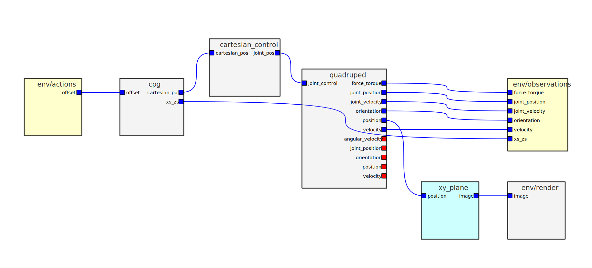

### Streamlining the transfer of simulated robot learning to the real-world

[](https://opensource.org/licenses/Apache-2.0)
[](https://github.com/psf/black)
[](https://eagerx.readthedocs.io/en/master/?badge=master)
[](https://github.com/eager-dev/eagerx/actions/workflows/ci.yml)
[](https://codeclimate.com/github/eager-dev/eagerx/maintainability)
[](https://codeclimate.com/github/eager-dev/eagerx/test_coverage)


What is EAGERx
--------------

EAGERx (Engine Agnostic Graph Environments for Robotics) enables users
to easily define new tasks, switch from one sensor to another, and
switch from simulation to reality with a single line of code by being
invariant to the physics engine. EAGERx explicitly addresses the
differences in learning between simulation and reality, with essential
features for roboticists such as a safety layer, signal delay
simulation, and controller switching for resets. A single RL pipeline
that works with both the simulated and real robots eliminates the chance
for mismatches between the simulation and reality implementation. The
defined task follows the OpenAI Gym interface, so one can plug in
algorithms from established RL libraries (e.g.,
[Stable-baselines3](https://github.com/DLR-RM/stable-baselines3) ) to
solve the task afterward, again minimizing implementation errors.

[Full documentation and tutorials available
here](https://eagerx.readthedocs.io/en/master/).

**We are currently working towards a first stable release!**

<p align="center">
  
  
   
  
</p>
<p align="center">
    
</p>


**Top:** Policies trained in simulation and zero-shot evaluated on real
systems using EAGERx. On the left the successful transfer of a
box-pushing policy is shown, while on the right this is the case for the
classic pendulum swing-up problem.

**Bottom:** The modular design of EAGERx allows users to create complex
environments easily through composition.

Installation
------------

You can do a minimal installation of `EAGERx` with:

```bash
pip3 install eagerx
```

We provide other options for installing EAGERx in [our
documentation](https://eagerx.readthedocs.io/en/master/) including using
Docker or Conda environment to have ROS1 setup.

### Extras: GUI

To install the whole set of features, you will need additional packages.
You can install for example eagerx with gui support by running:

```bash
pip3 install eagerx-gui
```



**Figure:** A visualisation of a graph as generated by the GUI.


### Extras: training visualization

In robotics it is crucial to monitor the robot\'s behavior during the
learning process. Luckily, inter-node communication within EAGERx can be
listened to externally, so that any relevant information stream can be
trivially monitored on-demand (e.g. with `rqt_plot`).

**Note:** `rqt_plot` is included in the `desktop` or `desktop-full` ROS
installation. Follow the [ROS installation
instructions](https://eagerx.readthedocs.io/en/latest/) to install ROS.


**Figure:** Internode communication can be plotted using `rqt_plot`.

Tutorials
---------

The following tutorials are currently available in the form of Google
Colabs:

**Introduction to EAGERx**

-   [Tutorial 1: Getting
    started](https://colab.research.google.com/github/eager-dev/eagerx_tutorials/blob/master/tutorials/icra/getting_started.ipynb)
-   [Tutorial 2: Advanced
    usage](https://colab.research.google.com/github/eager-dev/eagerx_tutorials/blob/master/tutorials/icra/advanced_usage.ipynb)

The solutions are available
[here](https://github.com/eager-dev/eagerx_tutorials/tree/master/tutorials/icra/solutions/).

**Developer tutorials**

-   [Tutorial 1: Environment Creation and Training with
    EAGERx](https://colab.research.google.com/github/eager-dev/eagerx_tutorials/blob/master/tutorials/pendulum/1_environment_creation.ipynb)
-   [Tutorial 2: Reset and Step
    Function](https://colab.research.google.com/github/eager-dev/eagerx_tutorials/blob/master/tutorials/pendulum/2_reset_and_step.ipynb)
-   [Tutorial 3: Space and
    Processors](https://colab.research.google.com/github/eager-dev/eagerx_tutorials/blob/master/tutorials/pendulum/3_space_and_processors.ipynb)
-   [Tutorial 4: Nodes and Graph
    Validity](https://colab.research.google.com/github/eager-dev/eagerx_tutorials/blob/master/tutorials/pendulum/4_nodes.ipynb)
-   [Tutorial 5: Adding Engine Support for an
    Object](https://colab.research.google.com/github/eager-dev/eagerx_tutorials/blob/master/tutorials/pendulum/5_engine_implementation.ipynb)
-   [Tutorial 6: Defining a new
    Object](https://colab.research.google.com/github/eager-dev/eagerx_tutorials/blob/master/tutorials/pendulum/6_objects.ipynb)
-   [Tutorial 7: More Informative
    Rendering](https://colab.research.google.com/github/eager-dev/eagerx_tutorials/blob/master/tutorials/pendulum/7_rendering.ipynb)
-   [Tutorial 8: Reset
    Routines](https://colab.research.google.com/github/eager-dev/eagerx_tutorials/blob/master/tutorials/pendulum/8_reset_routine.ipynb)
-   Tutorial 9: Speeding-up training with multi-processing (coming
    soon).

The solutions are available
[here](https://github.com/eager-dev/eagerx_tutorials/tree/master/tutorials/pendulum/solutions/).

For more information see the
[docs](https://eagerx.readthedocs.io/en/master/guide/tutorials/colabs.html)
or the [eagerx\_tutorials
package](https://github.com/eager-dev/eagerx_tutorials).

Code Example
------------

Below you can find a code example of environment creation and training
using
[Stable-Baselines3](https://stable-baselines3.readthedocs.io/en/master/).
To run this code, you should install
[eagerx\_tutorials](https://github.com/eager-dev/eagerx_tutorials),
which can be done by running:

```bash
pip3 install eagerx_tutorials
```

Detailed explanation of the code can be found in [this Colab
tutorial](https://colab.research.google.com/github/eager-dev/eagerx_tutorials/blob/master/tutorials/pendulum/1_environment_creation.ipynb).

```python
import eagerx
from eagerx.backends.single_process import SingleProcess
from eagerx.wrappers import Flatten
from eagerx_tutorials.pendulum.objects import Pendulum
from eagerx_ode.engine import OdeEngine

import stable_baselines3 as sb3
import numpy as np
from typing import Dict


class PendulumEnv(eagerx.BaseEnv):
    def __init__(self, name: str, rate: float, graph: eagerx.Graph, engine: eagerx.specs.EngineSpec,
                 backend: eagerx.specs.BackendSpec):
        self.max_steps = 100
        self.steps = None
        super().__init__(name, rate, graph, engine, backend, force_start=True)

    def step(self, action: Dict):
        observation = self._step(action)
        self.steps += 1

        th = observation["angle"][0]
        thdot = observation["angular_velocity"][0]
        u = float(action["voltage"])
        th -= 2 * np.pi * np.floor((th + np.pi) / (2 * np.pi))

        cost = th ** 2 + 0.1 * thdot ** 2 + 0.01 * u ** 2
        done = self.steps > self.max_steps
        info = {"TimeLimit.truncated": self.steps > self.max_steps}
        return observation, -cost, done, info

    def reset(self) -> Dict:
        states = self.state_space.sample()
        observation = self._reset(states)
        self.steps = 0
        return observation

if __name__ == "__main__":
    rate = 30.0

    pendulum = Pendulum.make("pendulum", actuators=["u"], sensors=["theta", "theta_dot"], states=["model_state"])

    graph = eagerx.Graph.create()
    graph.add(pendulum)
    graph.connect(action="voltage", target=pendulum.actuators.u)
    graph.connect(source=pendulum.sensors.theta, observation="angle")
    graph.connect(source=pendulum.sensors.theta_dot, observation="angular_velocity")

    engine = OdeEngine.make(rate=rate)
    backend = SingleProcess.make()

    env = PendulumEnv(name="PendulumEnv", rate=rate, graph=graph, engine=engine, backend=backend)
    env = Flatten(env)

    model = sb3.SAC("MlpPolicy", env, verbose=1)
    model.learn(total_timesteps=int(150 * rate))

    env.shutdown()
```

Engines
-------

EAGERx allows to create engine agnostic environments such that a single
environment can be used for simulation and reality. The following
engines are available for training and evaluation:

-   [RealEngine](https://github.com/eager-dev/eagerx_reality) for
    real-world experiments
-   [PybulletEngine](https://github.com/eager-dev/eagerx_pybullet) for
    PyBullet simulations
-   [OdeEngine](https://github.com/eager-dev/eagerx_ode) for simulations
    based on ordinary differential equations (ODEs)

Users can also create their own (custom) engines.

Cite EAGERx
-----------

If you are using EAGERx for your scientific publications, please cite:

``` {.sourceCode .bibtex}
@article{eagerx,
    author  = {van der Heijden, Bas and Luijkx, Jelle, and Ferranti, Laura and Kober, Jens and Babuska, Robert},
    title = {EAGERx: Engine Agnostic Graph Environments for Robotics},
    year = {2022},
    publisher = {GitHub},
    journal = {GitHub repository},
    howpublished = {\url{https://github.com/eager-dev/eagerx}}
}
```

Maintainers
-----------

EAGERx is currently maintained by Bas van der Heijden
([\@bheijden](https://github.com/bheijden)) and Jelle Luijkx
([\@jelledouwe](https://github.com/jelledouwe)).

How to contact us
-----------------

For any question, send an e-mail to *eagerx.dev@gmail.com*.

Acknowledgements
----------------

EAGERx is funded by the [OpenDR](https://opendr.eu/) Horizon 2020
project.

<p>
    
    
</p>