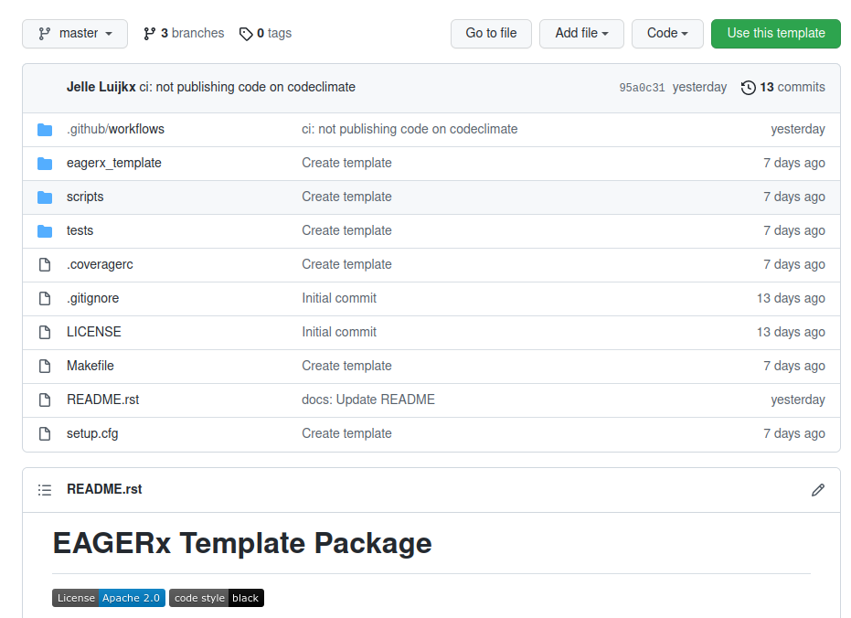

********
Template
********

We will start by creating a new repository for this Python package, using `the template that is available here <https://github.com/eager-dev/eagerx_template>`_.

    Screenshot of the EAGERx template package on Github.

As you can see, this template repository already contains some folders and files.
The main benefit of using this template, is that it facilitates to perform continuous integration and provides a clear code structure.
Since the package is just a Python package in the end, any other Python package structure could be used.

In our case, we create a new repository called `eagerx_ode <https://github.com/eager-dev/eagerx_ode>`_ using this template.
Since we want to create a package named *eagerx_ode* and not *eagerx_template*, we do the following:

* Rename the folder *eagerx_template* to *eagerx_ode*.
* Update the PACKAGE_NAME variable in Makefile to be *eagerx_ode* instead of *eagerx_template*.

Poetry
######

Next we will create a Python package using `Poetry <https://python-poetry.org/>`_.
If you are not familiar with Poetry, we recommend to check out `this article <https://nanthony007.medium.com/stop-using-pip-use-poetry-instead-db7164f4fc72>`_.
It is a very convenient tool for package management.
In the remainder of this section it is assumed that Poetry is installed.

Next, we modify the `pyproject.toml <https://github.com/eager-dev/eagerx_template/blob/master/pyproject.toml>`_ file to specify dependencies, add a short description, state the authors of the package etc. .
Here we specify scipy as dependencies, since we will be using scipy to perform the integration of the ODEs.
This results following `pyproject.toml <https://github.com/eager-dev/eagerx_ode/blob/master/pyproject.toml>`_.

Now we are ready to start coding! Note that you can always add or update dependencies later using Poetry.

After adding the source code, installing the package is simple (from the root of the repository):

.. code-block:: bash

    poetry install

.. note::
  This will install the package and its dependencies in a virtual environment, see https://python-poetry.org/docs/basic-usage/#using-your-virtual-environment.

Black
#####

In the *eagerx_template*, we also make use of `black <https://black.readthedocs.io/en/stable/>`_.
According to their docs:

*"By using Black, you agree to cede control over minutiae of hand-formatting.
In return, Black gives you speed, determinism, and freedom from pycodestyle nagging about formatting.
You will save time and mental energy for more important matters."*

It allows to automatically format your code such that it satisfies the *Black* code style requirements and allows to check these.
In the *eagerx_template* this can be done as follows.
First, we install the package using *Poetry*:

.. code-block:: bash

    poetry install

Next, we activate the poetry environment that is created during installation:

.. code-block:: bash

    poetry shell

Now we can format the code using black:

.. code-block:: bash

    make codestyle

Also, we can check the code style:

.. code-block:: bash

    make check-codestyle

.. note::
    A number of Github workflows are present within the *eagerx_template*.
    One of them checks for code style using *Black*.
    Therefore, when using this template for a public Github repository, don't forget to run:
    *make codestyle* before pushing your code.

pytest
######

Also, the *eagerx_template* allows to easily add tests using `pytest <https://docs.pytest.org/>`_.
You can add your own tests to the `tests folder <https://github.com/eager-dev/eagerx_template/tree/master/tests>`_.
Only a dummy test is currently present `here <https://github.com/eager-dev/eagerx_template/blob/master/tests/test_import.py>`_.
You can run the test as follows (from the root of the repository):

First, we install the package using *Poetry* (if you haven't done so yet):

.. code-block:: bash

    poetry install

Next, we activate the poetry environment that is created during installation:

.. code-block:: bash

    poetry shell

Now we run the tests:

.. code-block:: bash

    make pytest

.. note::
    A number of Github workflows are present within the *eagerx_template*.
    One of them checks if the tests are passing.
    So before pushing your code, you can check whether the tests are passing locally by running *make pytest*.

.. note::
  Be aware that in order to use a :mod:`~eagerx.core.entities.Node`, :mode:`~eagerx.core.entities.EngineNode` or any other enitity from :mod:`eagerx.core.entities` you have created, that they should be imported before making them using :func:`~eagerx.core.entities.make` with the corresponding ID.
  Therefore, we advice to import these in the *__init__.py* as is done `for example here <https://github.com/eager-dev/eagerx_ode/blob/master/eagerx_ode/__init__.py>`_.
