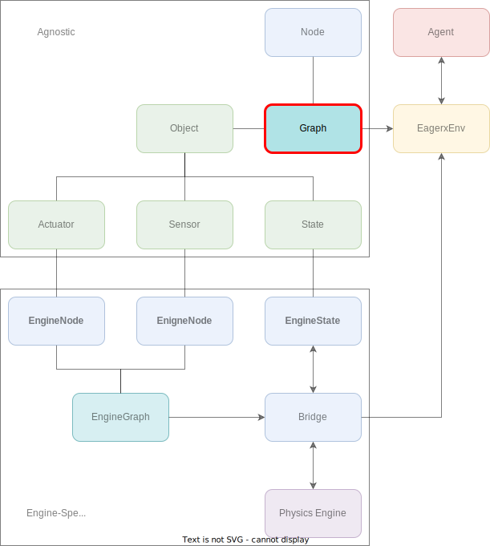
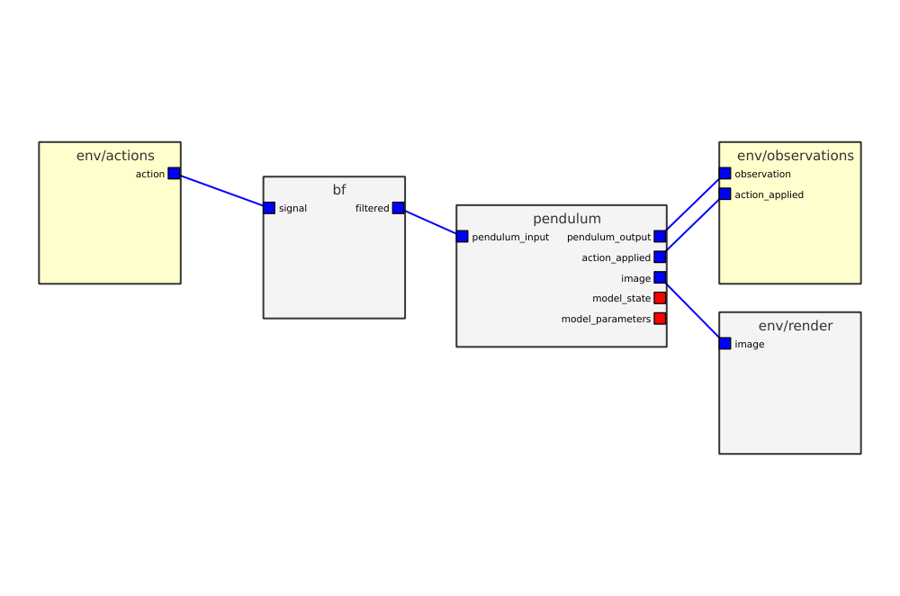

*****
Graph
*****

In this section we will discuss the concept of a :class:`~eagerx.core.graph.Graph`.
A :class:`~eagerx.core.graph.Graph` object can be created to connect inputs and outputs of different entities of types :class:`~eagerx.core.entities.Node`, :class:`~eagerx.core.entities.ResetNode` and :class:`~eagerx.core.entities.Object`.
This :class:`~eagerx.core.graph.Graph` can be used to initialize an :class:`~eagerx.core.env.EagerxEnv`.
Here, we will show an example of how to create such a :class:`~eagerx.core.graph.Graph`.
We will connect a `Pendulum <https://github.com/eager-dev/eagerx_dcsc_setups/blob/master/eagerx_dcsc_setups/pendulum/objects.py>`_ :class:`~eagerx.core.entities.Object` and `ButterworthFilter <https://github.com/eager-dev/eagerx/blob/master/eagerx/nodes/butterworth_filter.py>`_ :class:`~eagerx.core.entities.Node`.
Also, we will render the *Pendulum* object, using the :func:`~eagerx.core.graph.Graph.render` method.

`Full code is available here. <https://github.com/eager-dev/eagerx_dcsc_setups/blob/master/examples/example_ode.py>`_

  In this section we will discuss the concept of a :class:`~eagerx.core.graph.Graph`.
  A :class:`~eagerx.core.graph.Graph` consists of a collection of entities of type :class:`~eagerx.core.entities.Node` and :class:`~eagerx.core.entities.Object`.
  The graph is engine-agnostic and should be provided to the :class:`~eagerx.core.env.EagerxEnv`, such that communication pipelines can be set up correctly.

::

  # ROS packages required
  from eagerx import Object, Bridge, Node, initialize, log, process

  initialize("eagerx_core", anonymous=True, log_level=log.INFO)

  # Environment
  from eagerx.core.env import EagerxEnv
  from eagerx.core.graph import Graph
  from eagerx.wrappers import Flatten

  # Implementation specific
  import eagerx.nodes  # Registers butterworth_filter
  import eagerx_ode  # Registers OdeBridge
  import eagerx_dcsc_setups.pendulum  # Registers Pendulum

  if __name__ == "__main__":
    # Define rate (depends on rate of ode)
    rate = 30.0

    # Initialize empty graph
    graph = Graph.create()

    # Create pendulum
    pendulum = Object.make("Pendulum", "pendulum", render_shape=[480, 480], sensors=["pendulum_output", "action_applied"],
                       states=["model_state", "model_parameters"])
    graph.add(pendulum)

    # Create Butterworth filter
    bf = Node.make("ButterworthFilter", name="bf", rate=rate, N=2, Wn=13, process=process.NEW_PROCESS)
    graph.add(bf)

    # Connect the nodes
    graph.connect(action="action", target=bf.inputs.signal)
    graph.connect(source=bf.outputs.filtered, target=pendulum.actuators.pendulum_input)
    graph.connect(source=pendulum.sensors.pendulum_output, observation="observation", window=1)
    graph.connect(source=pendulum.sensors.action_applied, observation="action_applied", window=1)

    # Add rendering
    graph.add_component(pendulum.sensors.image)
    graph.render(source=pendulum.sensors.image, rate=10, display=True)

.. note::
  An :class:`~eagerx.core.entities.Object` can be created using the :func:`~eagerx.core.entities.make` method.
  Note that in order to be able to make the *Pendulum* :class:`~eagerx.core.entities.Object`, we need to import it: *import eagerx_dcsc_setups.pendulum*.
  This also holds for creating a :class:`~eagerx.core.entities.Node` using :func:`~eagerx.core.entities.Node.make` method: *import eagerx.nodes  # Registers butterworth_filter*.
  Furthermore, note that we first call the :func:`~eagerx.initialize` function.
  This starts a roscore and allows to initialize the communication pipelines.
  Also can be seen here that nodes and objects can be added to the :class:`~eagerx.core.graph.Graph` using the :func:`~eagerx.core.graph.Graph.add` method.
  Furthermore, nodes and objects can be connected using the :class:`~eagerx.core.graph.connect` method.
  For this method it is worth mentioning that if the *action* or *observation* argument is specified, the agent's action or obeservation space will be extended with that action or observation.
  The appropriate agent's `action and observation spaces <https://gym.openai.com/docs/#spaces>`_ can be created if a :class:`~eagerx.core.entities.SpaceConverter` is defined for the connected :attr:`~eagerx.core.specs.ObjectSpec.actuators`, :attr:`~eagerx.core.specs.ObjectSpec.sensors`, :attr:`~eagerx.core.specs.NodeSpec.inputs` or :attr:`~eagerx.core.specs.ObjectSpec.outputs`.

GUI
###

Having created the :class:`~eagerx.core.graph.Graph`, we can inspect it using the `GUI <https://github.com/eager-dev/eagerx_gui>`_.
Note that we need to install it first if you haven't done so yet:

.. code-block:: console

   pip install eagerx-gui

Next, we can open it by calling :func:`~eagerx.core.graph.Graph.gui`:

::

  graph.gui()

By clicking on *Show Graph*, we can inspect the graph in the GUI.
The output you will see should look something like this:

    Screenshot of the EAGERx GUI.

.. note::
  The GUI also provides functionalities for constructing a :class:`~eagerx.core.graph.Graph`.
  So we could also have created the exact same :class:`~eagerx.core.graph.Graph` from scratch using the GUI.
