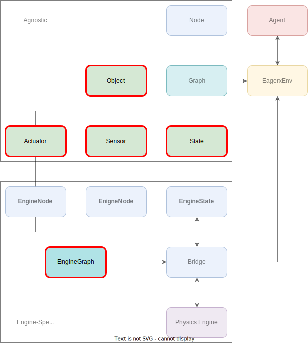

******************
Creating an Object
******************

In this section, we will discuss the concept of :mod:`~eagerx.core.entities.Object` within EAGERx by going through the steps of creating the :mod:`~eagerx_dcsc_setups.pendulum.objects.Pendulum` object.
For this *Pendulum* :mod:`~eagerx.core.entities.Object` we will create two bridge implementations, i.e. for the `*OdeBridge* <https://github.com/eager-dev/eagerx_ode>`_ and for the `*RealBridge* <https://github.com/eager-dev/eagerx_reality>`_.
This will allow us to use the same :mod:`~eagerx.core.entities.Object` for both simulated and real experiments.
We will start by implementing the agnostic part of the *Pendulum* (stuff that is independent from the :mod:`~eagerx.core.entities.Bridge` that is used).
Next, we will implement everything related to the *OdeBridge* and finally we create the implementation for the *RealBridge*.

`Full code is available here. <https://github.com/eager-dev/eagerx_dcsc_setups/blob/master/eagerx_dcsc_setups/pendulum/objects.py>`_

  In this section we will discuss the concept of a :mod:`~eagerx.core.entities.Object`.
  An :mod:`~eagerx.core.entities.Object` consists of a collection of :attr:`~eagerx.core.specs.ObjectSpec.actuators`, :attr:`~eagerx.core.specs.ObjectSpec.sensors` and :attr:`~eagerx.core.specs.ObjectSpec.states`.
  Within the :mod:`~eagerx.core.entities.Object`, we also define the :mod:`~eagerx.core.graph_engine.EngineGraph` by creating a graph of nodes of type :mod:`~eagerx.core.entities.EngineNode` for each physics engine.

.. toctree::
   :maxdepth: 2
   :caption: Table of Contents

   ./pendulum_agnostic
   ./pendulum_sim
   ./pendulum_real
