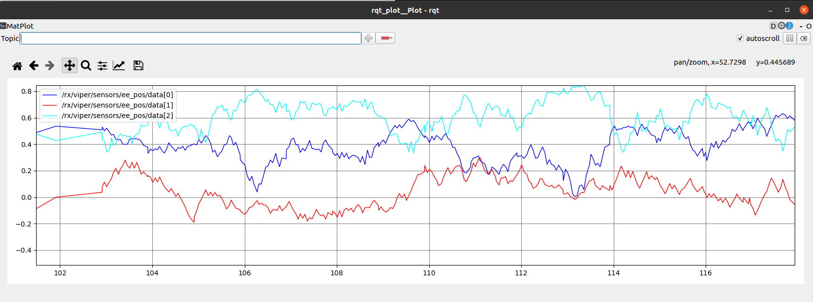
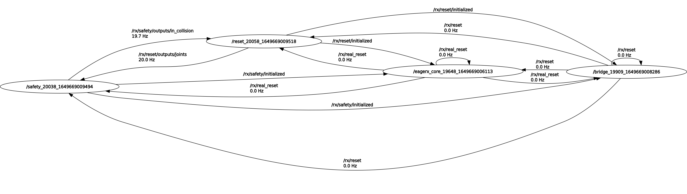

********************
EAGERx visualization
********************
In this tutorial we will demonstrate how you can use EAGERx to visualize parts of your environment.

EAGERx has a built-in GUI to visualize the environment. In addition, many tools from ROS can be used, as EAGERx
is build on top of ROS. These tools can give valuable insights on the workings of your environment.

.. note::
    The ROS tools we cover in this tutorial (e.g. ``rqt_plot``) are per default included in the ``desktop`` and
    ``desktop-full`` ROS installation.

    The tools can be manually installed with the lines below. Replace ``<DISTRO>`` with the supported ROS distributions
    (``noetic``, ``melodic``).

    .. code-block::

        sudo apt-get install ros-<DISTRO>-rqt
        sudo apt-get install ros-<DISTRO>-rqt-common-plugins

Live-plotting
*************
In robotics it is crucial to monitor the robot's behavior during the learning process.
Luckily, inter-node communication within EAGERx can always be listened to externally,
so that any relevant information stream can be trivially monitored on-demand.

Inter-node communication within EAGERx is always advertised as a topic that can be listened to externally, even
when nodes are interconnected within the same process. Therefore, we can leverage existing tools from ROS such as ``rqt_plot``.
``rqt_plot`` provides a GUI plugin visualizing numeric values in a 2D plot using different plotting backends.
See `here <http://wiki.ros.org/rqt_plot>`_ for more details on this tool.

Topic addresses for outputs/sensors/actuators follow the naming convention:

- ``<env_name>/<node_name>/<component>/<cname>``: (e.g. `env_1/controller/inputs/reference`).

- ``<env_name>/<object_name>/<component>/<cname>``: (e.g. `env_1/manipulator/sensors/joint_positions`).

Suppose you would like to visualize the end effector position with ROS message type
``Float32MultiArray`` that are produced by a sensor ``ee_pos`` of an  object called ``viper`` in an environment called
``rx``. To start a live-plot of the sensor messages, you can run the following command in a separate terminal while your
environment is running:

.. code-block::

    rqt_plot /rx/viper/sensors/ee_pos/data[0]:data[1]:data[2]

This will open a live-plot of the x, y, and z coordinate of the end effector similar to the one below.

.. note::
    The computational overhead of publishing of all node outputs as topics is minimal when there are no
    subscribers. In other words, computational overhead is only introduced when external sources are actually listening to
    the externally advertised topics.

Computation graph
*****************

``rqt_graph`` is a ROS tool that provides a GUI plugin for visualizing what's going in the ROS computation graph that EAGERx
creates for you based on the nodes, objects, and their interconnections.

To visualize the graph, you can run the following command in a separate terminal while your
environment is running:

.. code-block::

    rosparam set enable_statistics true
    rqt_graph

This will provide you with an overview similar to the one below:

    The ROS computation graph that EAGERx creates for you.

In the top left, you can refresh to update statistics about the messages that are passed in the graph. Also you can select
what to visualize:

-   `Nodes only`: This will only show the communication (i.e. topics) between nodes that were launched as a :attr:`~eagerx.core.constants
    .process.NEW_PROCESS`.

-   `Nodes/Topics (active)`: This will show all communication (i.e. topics) that are currently active.

-   `Nodes/Topics (all)`: This will show all communication (i.e. topics).

