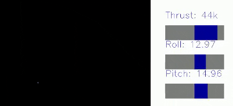
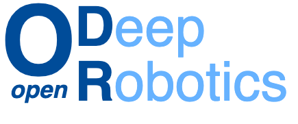

.. EAGERx documentation master file
   You can adapt this file completely to your liking, but it should at least
   contain the root `toctree` directive.

.. image:: https://img.shields.io/badge/License-Apache_2.0-blue.svg
   :target: https://opensource.org/licenses/Apache-2.0
   :alt: license

.. image:: https://img.shields.io/badge/code%20style-black-000000.svg
   :target: https://github.com/psf/black
   :alt: codestyle

.. image:: https://readthedocs.org/projects/eagerx/badge/?version=master
   :target: https://eagerx.readthedocs.io/en/master/?badge=master
   :alt: Documentation Status

.. image:: https://github.com/eager-dev/eagerx/actions/workflows/ci.yml/badge.svg?branch=master
   :target: https://github.com/eager-dev/eagerx/actions/workflows/ci.yml
   :alt: Continuous Integration

.. image:: https://api.codeclimate.com/v1/badges/3146dce3dd4c3537834c/test_coverage
   :target: https://codeclimate.com/github/eager-dev/eagerx/test_coverage
   :alt: Test Coverage

|

What is EAGERx
==============

You can use `EAGERx <https://github.com/eager-dev/eagerx>`_ (*Engine Agnostic Graph Environments for Robotics*) to easily define new (`Gymnasium compatible <https://gymnasium.farama.org/>`_) environments with modular robot definitions.

It enables users to:

* Define environments as graphs of nodes
* Visualize these graph environments interactively in a GUI
* Use a single graph environment both in reality and with various simulators

EAGERx explicitly addresses the differences in learning between simulation and reality, with native support for essential features such as:

* Safety layers and various other state, action and time-scale abstractions
* Delay simulation & domain randomization
* Real-world reset routines
* Synchronized parallel computation within a single environment

You can find the open-source code on `Github <https://github.com/eager-dev/eagerx>`_.

.. image:: _static/gif/box_pushing_pybullet.gif
   :width: 22.8%
.. image:: _static/gif/pendulum_sim.gif
   :width: 22.8%

.. image:: _static/gif/box_pushing_real.gif
   :width: 22.8%
.. image:: _static/gif/pendulum_real.gif
   :width: 22.8%
.. image:: _static/gif/crazyfly_real.gif
   :width: 50%

**Sim2Real:** Policies trained in simulation and zero-shot evaluated on real systems using EAGERx.
On the left the successful transfer of a box-pushing policy is shown, in the middle for the classic pendulum swing-up problem and on the right a task involving the crazyfly drone.

.. image:: _static/gif/all.gif
   :width: 100%

**Modular:** The modular design of EAGERx allows users to create complex environments easily through composition.

.. image:: _static/img/gui.svg
   :width: 100%

**GUI:** Users can visualize their graph environment.
Here we visualize the graph environment that we built in `this tutorial <https://colab.research.google.com/github/eager-dev/eagerx_tutorials/blob/master/tutorials/icra/advanced_usage.ipynb>`_.
See the `documentation <https://eagerx.readthedocs.io/en/master/guide/getting_started/index.html#extras-gui>`_ for more information.

.. image:: _static/gif/use_case.gif
   :width: 35.5%

.. image:: _static/gif/swim_real.gif
   :width: 25%

**Applications beyond RL:** The modular design and unified software pipeline of the framework have utility beyond reinforcement learning.
We explored two such instances: interactive language-conditioned imitation learning (left) and classical control with deep learning based perception in a swimming pool environment (right).

Video
=====

.. raw:: html

    

        <iframe src="https://www.youtube.com/embed/6t_NRb9iWP0" frameborder="0" allowfullscreen style="position: absolute; top: 0; left: 0; width: 100%; height: 100%;"></iframe>
    

Engines
=======

EAGERx enables a unified pipeline for real-world and simulated learning across various simulators.
The following engines/simulators are already available for training and evaluation:

* `RealEngine <https://github.com/eager-dev/eagerx_reality>`_ for real-world experiments
* `PybulletEngine <https://github.com/eager-dev/eagerx_pybullet>`_ for PyBullet simulations
* `OdeEngine <https://github.com/eager-dev/eagerx_ode>`_ for simulations based on ordinary differential equations (ODEs)

Users can easily add their own engines by implementing the `Engine` interface.

.. toctree::
   :maxdepth: 2
   :caption: Table of Contents

   guide/getting_started/index

   guide/tutorials/index

   guide/api_reference/index

   guide/examples/index

   guide/troubleshooting/index

   guide/contributing/index

Cite EAGERx
===========

If you are using EAGERx for your scientific publications, please cite:

.. code:: bibtex

    @article{eagerx,
        author  = {van der Heijden, Bas and Luijkx, Jelle, and Ferranti, Laura and Kober, Jens and Babuska, Robert},
        title = {EAGERx: Engine Agnostic Graph Environments for Robotics},
        year = {2022},
        publisher = {GitHub},
        journal = {GitHub repository},
        howpublished = {\url{https://github.com/eager-dev/eagerx}}
    }

Maintainers
===========

EAGERx is currently maintained by Bas van der Heijden (`@bheijden <https://github.com/bheijden>`_) and Jelle Luijkx (`@jelledouwe <https://github.com/jelledouwe>`_).

How to contact us
=================

..
  Follow us on Twitter `@EagerxD <https://twitter.com/EagerxD>`_!

For any question, send an e-mail to eagerx.dev@gmail.com.

Acknowledgements
================

EAGERx is funded by the `OpenDR <https://opendr.eu/>`_ Horizon 2020 project.

|delft_logo| |opendr_logo|

.. |box_sim| image:: _static/gif/box_pushing_pybullet.gif
   :width: 27%

.. |box_real| image:: _static/gif/box_pushing_real.gif
   :width: 27%

.. |pendulum_sim| image:: _static/gif/pendulum_sim.gif
   :width: 27%

.. |pendulum_real| image:: _static/gif/pendulum_real.gif
   :width: 27%

.. |crazyfly_real| image:: _static/gif/crazyfly_real.gif
   :width: 40%

.. |use_case| image:: _static/gif/use_case.gif
   :width: 35.5%

.. |swim_real| image:: _static/gif/swim_real.gif
   :width: 25%

.. |all| image:: _static/gif/all.gif
   :width: 97.5%

