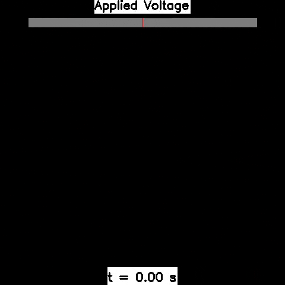

.. EAGERx documentation master file
   You can adapt this file completely to your liking, but it should at least
   contain the root `toctree` directive.

.. image:: _static/img/banner.png

.. image:: https://img.shields.io/badge/License-Apache_2.0-blue.svg
   :target: https://opensource.org/licenses/Apache-2.0
   :alt: license

.. image:: https://img.shields.io/badge/code%20style-black-000000.svg
   :target: https://github.com/psf/black
   :alt: codestyle

.. image:: https://readthedocs.org/projects/eagerx/badge/?version=master
   :target: https://eagerx.readthedocs.io/en/master/?badge=master
   :alt: Documentation Status

.. image:: https://github.com/eager-dev/eagerx/actions/workflows/ci.yml/badge.svg?branch=master
   :target: https://github.com/eager-dev/eagerx/actions/workflows/ci.yml
   :alt: Continuous Integration

.. image:: https://api.codeclimate.com/v1/badges/3146dce3dd4c3537834c/test_coverage
   :target: https://codeclimate.com/github/eager-dev/eagerx/test_coverage
   :alt: Test Coverage

|

What is EAGERx
==============

`EAGERx <https://github.com/eager-dev/eagerx>`_ (Engine Agnostic Graph Environments for Robotics) enables users to easily define new tasks, switch from one sensor to another,
and switch from simulation to reality with a single line of code by being invariant to the physics engine.
EAGERx explicitly addresses the differences in learning between simulation and reality,
with essential features for roboticists such as a safety layer, signal delay simulation, and controller switching for resets.
A single RL pipeline that works with both the simulated and real robots eliminates the chance for mismatches between the simulation and reality implementation.
The defined task follows the OpenAI Gym interface, so one can plug in algorithms from established RL libraries
(e.g., `Stable-baselines3 <https://github.com/DLR-RM/stable-baselines3>`_ ) to solve the task afterward, again minimizing implementation errors.

**We are currently working towards a first stable release!**

|box_sim| |box_real| |pendulum_sim| |pendulum_real|

|all|

**Top:** Policies trained in simulation and zero-shot evaluated on real systems using EAGERx.
On the left the successful transfer of a box-pushing policy is shown, while on the right this is the case for the classic pendulum swing-up problem.

**Bottom:** The modular design of EAGERx allows users to create complex environments easily through composition.

.. toctree::
   :maxdepth: 2
   :caption: Table of Contents

   guide/getting_started/index

   guide/tutorials/index

   guide/api_reference/index

   guide/examples/index

   guide/troubleshooting/index

   guide/contributing/index

Engines
-------

EAGERx allows to create engine agnostic environments such that a single
environment can be used for simulation and reality. The following
engines are available for training and evaluation:

-   [RealEngine](https://github.com/eager-dev/eagerx_reality) for
    real-world experiments
-   [PybulletEngine](https://github.com/eager-dev/eagerx_pybullet) for
    PyBullet simulations
-   [OdeEngine](https://github.com/eager-dev/eagerx_ode) for simulations
    based on ordinary differential equations (ODEs)

Users can also create their own (custom) engines.

Cite EAGERx
===========

If you are using EAGERx for your scientific publications, please cite:

.. code:: bibtex

    @article{eagerx,
        author  = {van der Heijden, Bas and Luijkx, Jelle, and Ferranti, Laura and Kober, Jens and Babuska, Robert},
        title = {EAGERx: Engine Agnostic Graph Environments for Robotics},
        year = {2022},
        publisher = {GitHub},
        journal = {GitHub repository},
        howpublished = {\url{https://github.com/eager-dev/eagerx}}
    }

Maintainers
===========

EAGERx is currently maintained by Bas van der Heijden (`@bheijden <https://github.com/bheijden>`_) and Jelle Luijkx (`@jelledouwe <https://github.com/jelledouwe>`_).

How to contact us
=================

..
  Follow us on Twitter `@EagerxD <https://twitter.com/EagerxD>`_!

For any question, send an e-mail to eagerx.dev@gmail.com.

Acknowledgements
================

EAGERx is funded by the `OpenDR <https://opendr.eu/>`_ Horizon 2020 project.

|delft_logo| |opendr_logo|

.. |box_sim| image:: _static/gif/box_pushing_pybullet.gif
   :width: 24%

.. |box_real| image:: _static/gif/box_pushing_real.gif
   :width: 24%

.. |pendulum_real| image:: _static/gif/pendulum_real.gif
   :width: 24%

.. |all| image:: _static/gif/all.gif
   :width: 97.5%

.. |delft_logo| image:: _static/img/tu_delft.png
   :width: 20%

.. |opendr_logo| image:: _static/img/opendr_logo.png
   :width: 20%
